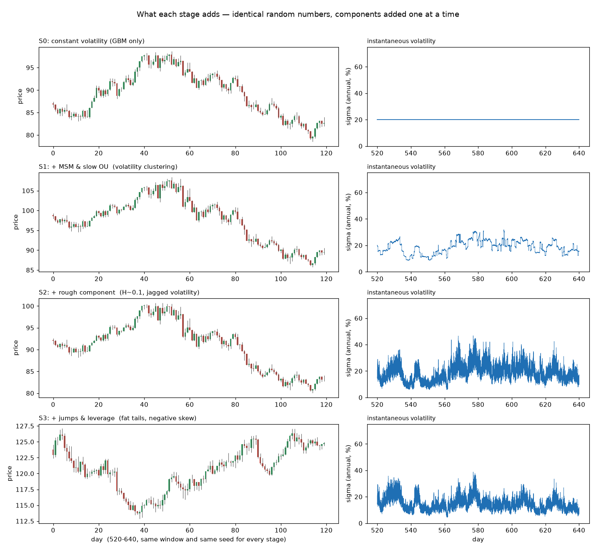
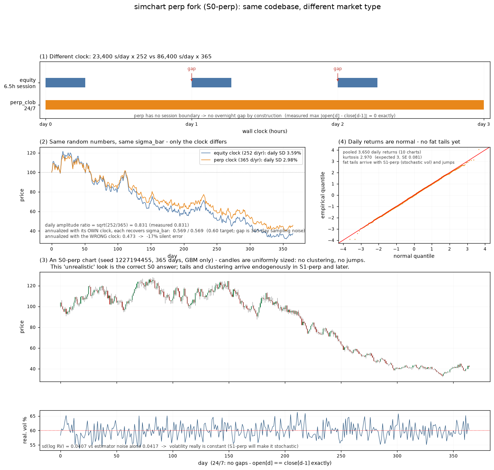

# simchart

金融マイクロストラクチャの数値シミュレータである。幾何ブラウン運動だけの骨格から
始めて、確率ボラティリティ、ジャンプ、日内季節性、決定論的カオス、指値注文板、
自己励起注文流、メタオーダー分割、板の状態依存性、情報価格との結合、実現ボラの
負のフィードバック、多資産の共通因子までを 14 の段階に分けて積み上げてある。

設計の中心にあるのは、各段階で何が出ていて何が出ていないかを確定させてから次に
進むという進め方である。段階の合否は、何が増えたかではなく何が変わらなかった
かで判定する。たとえばラフボラティリティを足す段階では、短スケールの粗さが
現れることよりも、長期記憶の指標 $d$ が前段階から $\pm 0.03$ 以内に留まることの
ほうが重要な合格条件になる。



同じ乱数から成分を 1 つずつ足したときの変化である。左が日足、右が同じ期間の
瞬間ボラティリティで、4 段階すべてで拡散乱数と確率ボラの実現が共通なので、これは
別々の乱数で描いた絵の並置ではなく成分そのものの効果を示している。乱数ストリームを
名前のハッシュから導出する設計がこれを可能にしている。

## 何が出るか

最終段階の生成物は、板のイベント列と、そこから構成される観測価格である。実証的に
知られている性質のうち、次のものが外生的に埋め込むことなく現れる。

| 性質 | 実測 | 由来する段階 |
|---|---|---|
| ボラティリティ・クラスタリングと長期記憶 | 日次 $\lvert r \rvert$ の $d = 0.43$ | S1 (MSM と緩慢 OU) |
| 裾の厚さ | 日次 Hill $\alpha = 3.3$ (危機日を除く) | S3 (ジャンプ) と S11 (危機) |
| 注文流の自己励起 | 分岐比 $\hat{n} = 0.83$、Fano 比 78 | S7 (Hawkes) |
| 約定符号の長期記憶 | 冪則の指数 $\gamma = 0.61$ | S8 (メタオーダー分割) |
| 流動性危機と二相回復 | 年 50 件、1 日で全戻し | S11 (負のフィードバック) |
| 脆弱な時期の決定論的再現 | 窓相関 0.976 | S12 (カオス注入) |
| Epps 効果とリードラグ | 1 分相関が日次の 0.4 パーセント | S13 (多資産) |

いずれも、その性質を作る項を書いたのではなく、下の層の機構から出ている。たとえば
Epps 効果は、資産ごとに独立なイベント時刻から自動的に発生する。これを明示的に
実装すると二重計上になり、非同期性という本来の発生機構が失われる。

## 使い方

```bash
uv sync

uv run python -m simchart.cli run --config configs/s0.yaml --stage S0
uv run python -m simchart.cli run --config configs/s13.yaml --seeds 10
uv run python -m simchart.cli validate --stage S12
uv run python -m simchart.cli compare --stages S12 S13

uv run pytest
```

実行すると `results/<段階>/metrics.json` に全指標とゲート判定が保存され、標準出力に
合否が表示される。`compare` は 2 つの段階の指標差分を出すもので、変わるべきものだけ
が変わったことの確認に使う。

模擬チャートの大量生成は次のとおりである。詳細は [docs/charts.md](docs/charts.md)。

```bash
uv run python scripts/generate_charts.py --n-charts 1000
uv run python scripts/make_s13_charts.py --n-charts 100
```

## 層構造

```
L0 カレンダー層   日内の活動度プロファイル、オーバーナイト
L1 潜在活動度層   多変量 Hawkes 過程による注文到着の強度
L2 情報価格層     ラフ成分、MSM、緩慢 OU、ジャンプ、レバレッジ、カオス
L3 板層           メタオーダー分割、状態依存の注文配置、約定
L4 建玉層         建玉と清算 (perp フォークで宣言、実装は後段)
```

層の境界はステートフルな再構成の位置に引いてある。L2 は全期間を先に生成し、L3 の
イベントループはそれを補間参照するだけにしてある。これにより L3 を変えても L2 の
価格経路が 1 ビットも動かないことを保証でき、段階間の差分が新機能の効果なのか
乱数がずれただけなのかを区別できる。設計の詳細は [docs/design.md](docs/design.md)。

## 検証の考え方

各段階に critical ゲートを定義し、すべて通ることを完了条件としている。最終段階では
135 個のゲートを判定する。ゲートは通すことを目的に閾値をいじるものではなく、落ちたら
原因を調べるものとして扱う。閾値が偶然でも落ちるほど厳しい場合の正しい対処は、閾値を
緩めることではなく推定量の精度を上げることである。

測定の設計で繰り返し効いた原則が 3 つある。

第一に、帰無対照を置くこと。素朴な標準誤差の式は等分散正規を仮定しており、不均一
分散や厚い裾を持つ系列では偽陽性を出す。実際にチャート 100 本の独立性検定で
$p = 7.5 \times 10^{-4}$ の相関ありという結果が出たが、各系列の振幅を保ったまま
符号だけを入れ替えた経験帰無分布と比べると $p = 0.79$ で、独立性は保たれていた。

第二に、有意でないことと効果がないことを区別すること。ある効果の推定値は 13 日で
$+142$、27 日で $-4$、84 日で $+93$ と 2 度符号が動き、27 日時点で先の結論は
誤りだったと訂正したが、その訂正自体が誤りだった。検出力が足りない状態での否定は結論にならない。

第三に、規模を先に決めて、結果を見てから標本を選び直さないこと。シードを引き直せば
どんな数字でも作れてしまう。乱数シードは記録し、窓から逸脱した実行は除外理由とともに
残す。

## 段階の一覧

| 段階 | 内容 | タグ |
|---|---|---|
| S0 | 幾何ブラウン運動のみの骨格。フラグ設計、乱数設計、検証基盤 | `S0-skeleton` |
| S1 | MSM と緩慢 OU による確率ボラティリティ | `S1-msm-ou` |
| S2 | 定常 fOU のラフ成分 (Hurst 指数 0.1) | `S2-rough` |
| S3 | Kou 二重指数ジャンプと 2 チャネルのレバレッジ | `S3-jump-leverage` |
| S4 | 日内季節性とオーバーナイト、およびその除去道具 | `S4-seasonality` |
| S5 | 決定論的カオスによるレジーム構造、L2 の構造凍結 | `S5-L2-frozen` |
| S6 | 指値注文板とイベント駆動エンジン (毎秒 1000 万イベント) | `S6-zi-book` |
| S7 | 符号対称な多変量 Hawkes 注文流 | `S7-hawkes` |
| S8 | メタオーダー分割による約定符号の長期記憶 | `S8-metaorder` |
| S9 | 板の状態に依存する意思決定層 | `S9-queue-reactive` |
| S10 | 情報価格と板の結合、観測への L2 性質の出現 | `S10-coupled` |
| S11 | 実現ボラの負のフィードバックと内生的な流動性危機 | `S11-feedback` |
| S12 | 活動度と脆弱性へのカオス注入 | `S12-chaos-l1` |
| S13 | 多資産の共通因子と創発するクロス性質 | `S13-multi-asset` |

各段階で何を測り、どの数値で判定し、どこで設計を変えたかは
[docs/stages.md](docs/stages.md) に記録してある。

## perp フォーク

ブランチ `perp` は、同じコードベースを無期限先物 (24 時間連続取引) 向けに拡張した
ものである。市場タイプによる分岐で実装しており、株式側のすべての基準結果がビット
単位で保たれることを回帰テストで保証している。



詳細は [docs/perp-fork.md](docs/perp-fork.md)。

## リポジトリの構成

```
simchart/          パッケージ本体
  config.py        全段階のフラグ、設定の読み込み、未実装フラグの拒否
  rng.py           名前ベースの層別乱数ストリーム
  grid.py          時間軸の単一情報源
  types.py         価格過程、イベント列、板断面、観測
  pipeline.py      層の組み立て、決定性と乱数安定性の検査
  layers/          L0 から L4 の各層
  validation/      推定量、ゲート定義、検証スイート
  cli.py           run と validate と compare
configs/           段階ごとの設定
scripts/           チャート生成、較正、図の作成
tests/             377 件の自動テスト
results/           段階ごとの指標と設計判断の記録
docs/              設計、段階記録、チャート、perp フォーク
```

本体 23,000 行、テスト 5,500 行、補助スクリプト 5,900 行である。

## 再現性

同一シードの 2 回の実行がビット単位で一致することを毎回検査している。乱数ストリームは
ストリーム名のハッシュから導出するので、後段で新しいストリームを足しても既存の系列は
変わらない。この設計は多資産化の段階で最終試験を受け、資産を 1 本追加しても既存資産の
系列が 1 ビットも動かないことが確認された。

チャートの生成物についても、シードさえ記録しておけば 1 秒刻みの完全な経路を再生成
できるので、日足だけを保存して中間データは捨ててよい。
