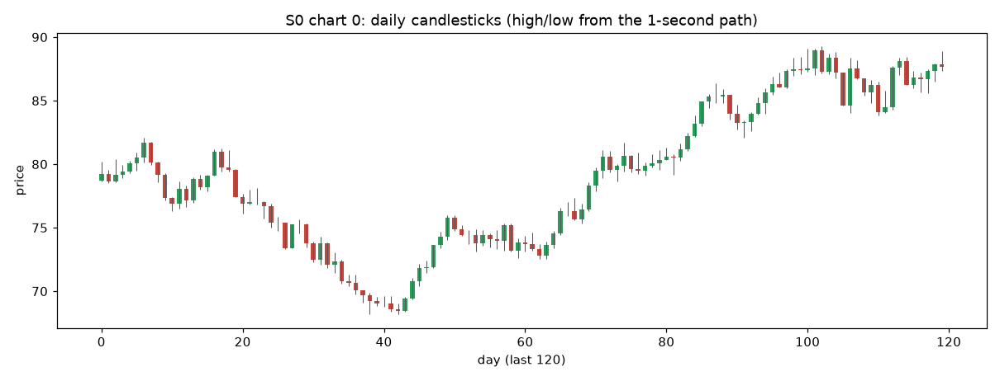
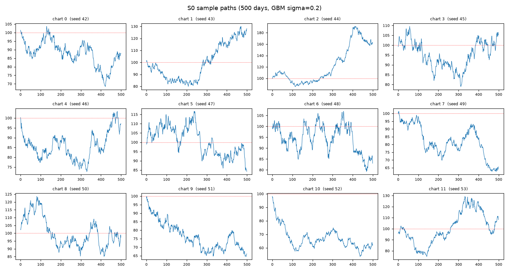
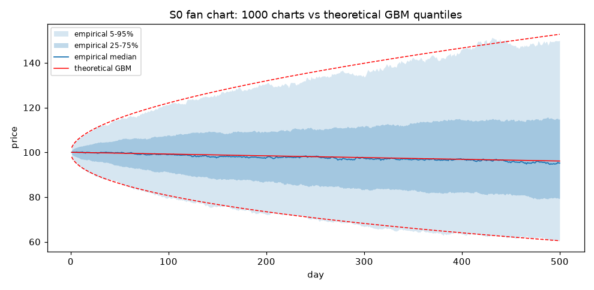

# simchart — 段階構築式の金融マイクロ構造シミュレータ

S0〜S13 の 13 段階で作る市場マイクロ構造シミュレータ。**このリポジトリの現状は
S1 (MSM + 緩慢 OU の確率ボラティリティ) まで。**

- **S0** (`git tag S0-skeleton`): 幾何ブラウン運動のみの骨格層。フラグ設計・
  RNG 設計・検証スイート・結果永続化。尖度 3・|r| 自己相関ゼロ・単一フラクタルが正解
- **S1** (`git tag S1-msm-ou`): L2 に MSM と緩慢 OU を追加。|r| の長期記憶・
  ボラティリティ・クラスタリング・集計正規性が初めて現れる。革新項は正規のまま
  (テールはボラ過程から内生的に出す)

---

## 使い方

```bash
uv sync                                  # 依存の導入 (Python 3.12+)

uv run python -m simchart.cli run --config configs/s0.yaml --stage S0
uv run python -m simchart.cli run --config configs/s1.yaml --stage S1   # 5000 日 (約 2 分)
uv run python -m simchart.cli validate --stage S1          # 保存済み結果の再判定
uv run python -m simchart.cli compare --stages S0 S1       # 段階間の指標差分
uv run pytest                                              # テスト
```

`run` の主なオプション: `--seed` / `--n-days` / `--steps-per-day` /
`--results-dir` / `--no-plots`。終了コードは critical ゲート全合格で 0、
不合格があれば 1、未実装フラグに触れた場合は 3。

出力は `results/<stage>/metrics.json` と `results/<stage>/plots/*.png`。

---

## 層構造 (最終系)

```
L0 カレンダー層   φ(t) 日内U字・寄引・オーバーナイト
       ↓
L1 潜在活動度層   λ(t) = φ_λ(t)·μ·Z_t + 多変量Hawkes      ← χ₁, χ₃ 注入点
       ↓
L2 情報価格層     log v_t = ラフ(H≈0.1) + MSM + 緩慢OU + レバレッジ  ← χ₂ 注入点
                  p*(t) = マルチンゲール + Hawkesジャンプ
       ↓ κ（結合強度）
L3 板層           メタオーダー分割 → 6次元Hawkes注文流 →
                  queue-reactive板 → uncertainty zones で離散化
       ↓
   RV_t ──フィードバック──→ L1(n_t), L3(取消率/配置距離)
```

観測価格は板のミッドであり、p\*(t) は外生生成される潜在情報価格。注文流の一部が
p\* 方向にバイアスを持つ (ハイブリッド方式)。**S0 では L0 / L1 / L3 はスタブ**で、
observed price = p\*(t) をそのまま返す。

```
simchart/
  config.py            全段階のフラグ / YAML・JSON ロード / 未実装フラグの拒否
  rng.py               名前ベースの層別 RNG ストリーム
  types.py             PriceProcess, EventLog, BookSnapshot, Observation,
                       BarSeries, StageResult, 各層の Protocol
  layers/
    l0_calendar.py     STUB: phi(t) -> 1.0、等間隔セッション
    l1_activity.py     STUB: 定数強度、イベント生成は拒否
    l2_price.py        GBM 実装 + S1〜S5 の拡張フック
    l3_book.py         STUB: observed = p*
  pipeline.py          層の組み立て / 駆動方式の選択 / 決定性・RNG 安定性の検査
  validation/
    base.py            ok / not_applicable / error の共通表現
    tails.py           Hill 推定量, QQ, 基本モーメント
    memory.py          ACF, Ljung-Box, GPH, local Whittle, 冪則当てはめ
    scaling.py         分散比, スケール別尖度, zeta_q, signature plot, ADF
    micro.py           符号ACF, propagator, 平方根則, 分岐比再推定
    cross.py           Hayashi-Yoshida
    suite.py           run_all() -> dict
    gates.py           段階別ゲート定義と判定
  report.py            metrics.json の書き出し・読み直し・プロット・段階間比較
  cli.py               run / validate / compare
scripts/
  seed_sweep.py        ゲートの誤検出率をシードを変えて実測する
  generate_charts.py   模擬チャートを大量生成する
  verify_charts.py     生成済みチャートを別経路で再計算して検証する
docs/images/           README に貼る図。results/ 側のプロットの複製で、
                       generate_charts.py で再生成できる (README 表示のため追跡する)
tests/
  test_determinism.py          同一シード 2 回実行でビット単位同一
  test_rng_stability.py        新ストリーム追加後も既存ストリームが不変
  test_flags.py                未実装フラグで NotImplementedError (段階名つき)
  test_validation_na.py        micro / cross が例外でなく N/A を返す
  test_price_process.py        at() の格子点厳密一致・格子間単調・冪等
  test_gates_detect_defects.py 欠陥を仕込むと**狙ったゲートだけが落ちる**
  test_report_and_cli.py       書き出し→読み直し→再判定→比較の往復
```

---

## 設計上の決定 (後段全部を規定するので先に読むこと)

### 1. RNG は名前ハッシュ方式 (`rng.py`)

子シードを `sha256(f"{master}:{stream_name}")` から導出する。`SeedSequence.spawn()`
は**呼び出し順に子シードを配るので使えない** — 途中に新しい spawn を挟むと以降が
全部ずれる。名前方式なら、S3 でジャンプ用ストリームを足しても拡散の経路は S2 と
ビット単位で同一のままになり、「新機能の効果」と「乱数がずれただけ」を区別できる。

- L2 と L3 のストリームは接頭辞で分離してあり、共有しない。共有すると S10 で L3 を
  変えただけで L2 の価格経路が動き、結合前後の比較が成立しなくなる。
- 未宣言のストリーム名は既定で拒否する (`strict=True`)。打ち間違いは「有効に見える
  別の系列」を静かに返すという最悪の壊れ方をするため。
- 後段で使う予定の名前は `RESERVED_STREAM_NAMES` に先に確保してある。

### 2. `PriceProcess` は配列ではなく補間可能なオブジェクト (`types.py`)

S10 で L3 が不規則なイベント時刻に p\* を参照する。`at(t)` は線形補間で、
**決定論的かつ冪等**である。問い合わせのたびに乱数を引くブラウン橋にすると
問い合わせ順序が価格経路を変えてしまい、「L3 を変えても L2 は不変」という保証が
崩れる。代償としてグリッド間隔より短いスケールで分散が過小になるので、必要に
なったら (a) L2 のグリッドを細かくする、(b) `interpolation="brownian_bridge"` を
実装して問い合わせ時刻を事前に確定させてから一括で橋を張る、の順で対処する。
`l2.bridge` ストリームは予約済み。

S3 でジャンプを入れるときは、線形補間がジャンプをなますので**ジャンプ時刻を必ず
グリッド点に載せる**こと。

### 3. セッション境界をまたぐ差分をリターンにしない

`Observation.to_bars()` は `(セッション, バー)` の 2 次元で返す。S0 にオーバーナイトは
無いので実質差は出ないが、S4 でギャップを入れた瞬間に「日をまたぐ差分」が巨大な
外れ値として ACF を汚す。最初からその構造で測る。

例外は |リターン| の長期記憶で、こちらは連結した 1 次元系列で測る。ボラティリティ
過程は日をまたいで続くものなので、日をまたぐラグを見られないと「今日のボラが明日の
ボラを予測するか」が測れない。連結で偽の値は生じない (各 |r| はセッション内で完結)。

### 4. ゲートは閾値を緩めず、測り方を選ぶ

指示書の閾値をそのまま使うと、推定量の精度が足りずに偶然でも落ちる箇所があった。
対処は閾値を緩めることではなく、閾値が意味を持つ精度で測ることにした。

| 指標 | 素朴な測り方 | 標準誤差 | ゲート幅 | 採った測り方 |
|---|---|---|---|---|
| 尖度 (スケール別) | 全スケールを判定 | 1 日スケールで 0.22 | ±0.4 | 標本数 10,000 未満のスケールは**記録のみ** |
| GPH の d | m = N^0.5 | 0.030 | ±0.05 | m = N^0.65 (標準誤差 0.011) |
| Ljung-Box | 5 ラグの最小 p 値 | — | p>0.01 | ラグ 20 単独で判定 (多重比較を避ける) |

基準リターンの粒度は 1 分 (`validation.primary_bar_sec`)。既定設定で約 195,000 本
取れ、尖度の標準誤差が 0.011 になるので `[2.7, 3.3]` が本物の検定になる。

### 5. 未実装フラグは黙って無視しない

`Config.__post_init__` が `NotImplementedError` を送出し、メッセージに実装段階と
追加先ファイルを含める。各層のビルダーでも二重にチェックしてある (Config を
経由しない直接構築で静かにスタブが使われるのを防ぐため)。

### 6. 指示書との差分

- `Config` に **`p0` (初期価格水準、既定 100.0)** を足した。S9 の tick size で
  価格水準が必要になり、そのとき追加すると設定ファイルの互換性が壊れるため。
  リターン系の統計には一切影響しない。
- 検証スイートの推定器設定を `Config.validation` (`ValidationConfig`) に分離した。
  モデル設定ではなく「測定器の設定」であり、段階をまたいで固定したいため。
- `requires-python` は 3.12 以上 (numpy 2.5 系の下限)。
- ゲートを 2 つ足した: `acf_abs_r_lag1` (指示書 §7 で「あり」とされているもの) と
  `rng_streams_distinct` (名前ハッシュの衝突検出)。

---

## S0 のゲート

| ゲート | 指標 | 条件 |
|---|---|---|
| pipeline_runs | `runtime.pipeline.completed` | 例外なく完走 |
| determinism | `runtime.determinism.bitwise_identical` | 同一シード 2 回でビット単位同一 |
| rng_stability | `runtime.rng_stability.unchanged` | ダミーストリーム追加後も既存が不変 |
| rng_streams_distinct | `runtime.rng_stability.streams_distinct` | 宣言済みストリームが相互に別系列 |
| acf_r_lag1 | `memory.acf_r.lag1_z` | \|ρ(1)\| < 2/√N |
| acf_abs_r_lag1 | `memory.acf_abs_r.lag1_z` | \|ρ(1)\| < 2/√N |
| ljung_box | `memory.ljung_box_r.pvalue_primary` | p > 0.01 (ラグ 20) |
| gph_d | `memory.gph_abs_r.d` | \|d\| < 0.05 |
| variance_ratio | `scaling.variance_ratio.max_abs_dev` | 全 q で 0.90〜1.10 |
| kurtosis | `tails.moments.kurtosis` | 2.7〜3.3 |
| kurtosis_flat | `scaling.kurtosis_by_scale.max_abs_dev_from_3_gated` | 全ゲート対象スケールで 2.6〜3.4 |
| zeta_q_linear | `scaling.zeta_q.r2` | R² > 0.99 |
| signature_plot_flat | `scaling.signature_plot.max_rel_dev` | 中央値からの最大相対乖離 < 0.10 |
| adf | `scaling.adf.combined_ok` | log P で棄却せず・r で棄却 |
| validation_callable | `runtime.validation.all_callable` | 全検証関数が例外なく呼べる |
| artifacts_written | `runtime.artifacts.metrics_json_ok` | metrics.json が存在し全項目を含む |

`results/<stage>/metrics.json` は単なるログではなく**回帰テストの基準**である。
後段で異常が出たときに「どの段階までは正常だったか」を遡るために段階ごとに残し、
git に追跡させる (プロットは再生成できるので追跡しない)。

### ゲートが落ちる能力を持つことの確認 (帰無対照)

合格するだけのゲートは無価値なので、両方向から確かめてある。

- **欠陥を仕込めば落ちること** — `tests/test_gates_detect_defects.py`。MA(1) の
  系列相関 / t 分布革新 / ボラティリティ・クラスタリング / 定常 AR(1) の対数価格 /
  マイクロストラクチャー・ノイズ / 検証関数の例外、の 6 種を注入し、**狙った
  ゲートだけが落ちる**ことを確認する。特にボラティリティ・クラスタリングでは
  `acf_r_lag1` が通ったまま `acf_abs_r_lag1` だけが落ちること (「リターンは無相関
  だがボラは持続する」を切り分けられていること) を固定してある。
- **正しい実装では落ちないこと** — `scripts/seed_sweep.py`。

### ★ 既知の問題: ±2σ の ACF ゲートは偽陽性を出す

本番設定でシードだけを 40 通り変えた実測 (`uv run python scripts/seed_sweep.py 40`,
所要 153 秒):

| ゲート | 不合格 | 率 | 値の範囲 | 閾値 |
|---|---|---|---|---|
| `acf_r_lag1` | 1/40 | **2.5%** | [−2.38, +1.70] | ±2 |
| `acf_abs_r_lag1` | 2/40 | **5.0%** | [−1.97, +2.21] | ±2 |
| `ljung_box` | 0/40 | 0% | [0.026, 0.989] | >0.01 |
| `gph_d` | 0/40 | 0% | [−0.033, +0.030] | ±0.05 |
| `variance_ratio` | 0/40 | 0% | [0.005, 0.055] | <0.10 |
| `kurtosis` | 0/40 | 0% | [2.976, 3.026] | [2.7, 3.3] |
| `kurtosis_flat` | 0/40 | 0% | [0.016, 0.125] | <0.4 |
| `zeta_q_linear` | 0/40 | 0% | [1.000, 1.000] | >0.99 |
| `signature_plot_flat` | 0/40 | 0% | [0.003, 0.024] | <0.10 |
| `adf` | 0/40 | 0% | — | — |

1 つ以上落ちた実行は 3/40 = 7.5%。

`acf_r_lag1` と `acf_abs_r_lag1` は指示書 §8 の `|ρ(1)| < 2/√N` をそのまま実装して
あるが、**これは有意水準 4.6% の検定なので、正しい実装でもその頻度で落ちる。**
理論値 4.55% と実測 2.5% / 5.0% は整合している。2 つのゲート × 14 段階 = 28 回の
検定なので、通しでどこかが偽陽性になる確率は 1 − (1 − 0.0455)²⁸ ≈ **73%** に
なる。回帰テストとしては使い物にならない水準である。

**これは実装の欠陥ではなくゲートの設計上の性質なので、閾値は指示書どおり ±2 のまま
にしてある。** 変更するかどうかは仕様の判断なので、こちらでは動かさない。判断材料:

- 閾値を **±3** にすると 1 回あたり 0.27%、28 回通しでも 7% に下がる。検出力は
  実質落ちない — 欠陥テストで仕込んだ MA(1) (θ=0.1) は z ≈ 28、
  マイクロストラクチャー・ノイズはさらに大きく、いずれも 3σ で余裕をもって落ちる。
- あるいは `ljung_box` に判定を任せて 2 つを `critical=False` の警告に落とす。
  Ljung-Box はラグ 20 までを同時に検定するので、単一ラグの ACF より**実際の欠陥に
  対する検出力は高く、かつ有意水準が正しい** (実測 0/40)。
- 変更する場合の編集箇所は `simchart/validation/gates.py` の `S0_GATES` の
  `_abs_lt(2.0)` 2 か所のみ。

他のゲートは、閾値を緩めずに「閾値が意味を持つ精度で測る」設計 (標本数不足の
スケールを判定から外す、GPH のバンド幅を N^0.65 にする) が効いており、40 シードで
一度も偽陽性を出していない。

---

## S0 の基準値 (seed=42, 500 日 × 23400 ステップ, 全 16 ゲート合格)

正確な値は `results/S0/metrics.json` を見ること。以下は読みやすさのための抜粋。

| 指標 | 値 | 期待 |
|---|---|---|
| 尖度 (60 秒リターン, n=195,000) | 3.0119 (s.e. 0.0111) | 3 |
| 尖度のスケール依存 (1 秒〜900 秒) | 3.0002 → 2.9919、最大乖離 0.0145 | 全スケールで 3 |
| ACF(r) ラグ1 | 0.00275 (z=+1.21) | 0 |
| ACF(\|r\|) ラグ1 | 0.000129 (z=+0.06) | 0 |
| Ljung-Box p (ラグ20) | 0.243 | 一様 |
| GPH d (\|r\|, m=2744) | −0.0020 (s.e. 0.0122) | 0 |
| 分散比 (q=2〜64) | 0.9960〜1.0041、全て \|z\|<1.3 | 1 |
| ζ_q (q=0.5〜3) | q/2 からの最大乖離 0.00032、R²=0.99999998 | q/2 の直線 |
| signature plot | 全スケールで年率ボラ 0.1998〜0.2009 | 0.20 で平坦 |
| ADF p | log P: 0.266 / r: 0.000 | 棄却せず / 棄却 |
| Hill α (k=0.5%→10%) | 9.85 → 4.73 (不安定度 0.67) | 大きく不安定 |

signature plot から復元される年率ボラが全スケールで `sigma_bar = 0.20` に一致して
いることは、時間換算 (秒 → 年) が正しいことの独立な証拠になっている。

Hill 推定量が k とともに単調に動くのは正規標本として正しい挙動である。**S0 でこれが
平坦になっていたら革新項にファットテールを混ぜてしまっている。**

---

## 模擬チャートの生成

```bash
uv run python scripts/generate_charts.py --n-charts 1000     # 生成 (1000 本で約 8 分)
uv run python scripts/verify_charts.py --stage S0            # 出力の検証
uv run python scripts/generate_charts.py --recompute         # 集計だけ作り直す
```

1 本 = **独立した 1 本の価格経路**。`Config.seed` を 1 ずつずらして生成する。RNG が
名前ハッシュ方式なので、シードが違えば全ストリームが独立になる。逆に言えば
**seed を記録してあればどのチャートでも 1 秒刻みの完全な経路をビット単位で
再生成できる**ので、日足だけ保存して 1 秒データ (1 本あたり 94 MB) は捨ててよい。



*chart 0 (seed 42) の直近 120 日。ヒゲは 1 秒刻みの経路から取った日中の高値・安値で
あり、始値と終値だけから作った偽物ではない。実チャートに比べてヒゲが短いのは
日中のボラ変動がまだ無いためで、S1〜S2 で変わる。*



*12 本の標本。赤い点線が初期価格 100。1000 本すべてが独立で、どれも
`seed` から完全に再生成できる。*

### 出力 (`results/<stage>/charts/`)

| ファイル | 内容 | 1000 本 × 500 日での大きさ |
|---|---|---|
| `daily_ohlc.parquet` | 全チャートの日足 OHLC + 日次リターン + 実現ボラ (50 万行) | 23.6 MB |
| `intraday_ohlc_sample.parquet` | 先頭 10 本の分足 OHLC (195 万行) | 58.6 MB |
| `charts_index.parquet` / `.csv` | チャートごとの seed・要約統計・終値ダイジェスト | 0.1 MB |
| `ensemble_metrics.json` | 集団としての検証結果 (**これが本体**) | 4 KB |
| `plots/` | 標本経路・ファンチャート・終端分布・ローソク足 | — |

parquet と csv は `.gitignore` してある (seed から完全に再生成できるため)。
`ensemble_metrics.json` だけは何をどう生成したかの記録なので追跡する。

### 出来高の列は作らない

S0 には注文流が無い (L1 は定数強度のスタブ、L3 は恒等写像) ので、出来高を付けたら
それは**捏造**になる。出来高が内生的に決まるのは S6 で板層、S7 で Hawkes 注文流を
入れてからである。代わりに、日中の 1 秒リターンから計算した**実現ボラティリティ**を
列に持たせてある。これは経路から実際に測れる量である。

### 集団としての検証 (1000 本 × 500 日, seed 42〜1041)

個々のチャートが「それらしく」見えても、集団として幾何ブラウン運動になっていなければ
意味がない。`ensemble_metrics.json` に全部入っている。



*青が 1000 本の経験分位帯 (5-95% と 25-75%)、赤が理論 GBM の分位点。日 500 での
5% 点は経験 60.73 に対し理論 60.47 (比 1.004)。**この図は目視で判断しないこと** —
帯の端が理論線から離れて見えても、実際には一致していることがある (実際に一度
読み違えた)。数値は下の表と `ensemble_metrics.json` を見る。*

| 検査 | 実測 | 理論 |
|---|---|---|
| 実現ボラ (年率) 平均 | 0.20000 | 0.20000 |
| 実現ボラ 全チャートの範囲 | [0.19988, 0.20015] | ±4 s.e. で [0.19983, 0.20017] |
| 日中値幅 `log(high/low)` 平均 | 0.020017 | 0.020009 (比 1.0004) |
| 実体 `\|log(close/open)\|` 平均 | 0.010065 | 0.010052 (比 1.0013) |
| 日次リターン 標準偏差 | 0.012607 | 0.012599 |
| 日次リターン 尖度 (n=50 万) | 2.9953 | 3 (s.e. 0.0069) |
| 日次リターン ACF(1) | +0.00186 | 0 (z = +1.32) |
| 終端 対数リターン 平均 | −0.04844 | −0.03968 (s.e. 0.00872) |
| 終端 対数リターン 標準偏差 | 0.27569 | 0.28172 |
| **終端 単純リターン 平均** | **0.98967** | **1.00000** (s.e. 0.00883) |
| 終端分布の KS 検定 | D=0.0219 | p=0.714 |
| チャート間相関 z の標準偏差 | 1.0008 | 1 |
| チャート間相関 \|z\|>1.96 の割合 | 5.01% | 5% |
| チャート間相関 最大 \|z\| | 5.24 | 超過確率 p=0.078 |

読み方の注意を 3 つ。

- **終端の単純リターン平均が 1 になること**が、伊藤補正 (`−σ²/2`) が正しく
  入っていることの検査になっている。対数リターンの平均は −0.0397 と負だが、
  価格そのものはマルチンゲールである。両者を混同しない。
- **日中値幅が理論値と一致すること**は、高値・安値が本当に 1 秒経路から来ている
  証拠である。高値・安値は終値からは復元できない量なので、ここが合わなければ
  OHLC の作り方が間違っている。理論値には離散標本による過小評価の補正
  (Broadie-Glasserman-Kou, 相対 −0.48%) を入れてあり、補正前だと比が 0.9956 に
  なる。補正が効いていることまで確認できている。
- **チャート間相関の最大 \|z\| = 5.24 は「目安 4.75」を超えているが異常ではない。**
  最大値の分布は右に裾を引くので、目安との大小ではなく超過確率で判断する
  (499,500 組に対して p=0.078)。実際、z の分布全体は標準正規と一致している
  (標準偏差 1.0008、\|z\|>1.96 が 5.01%)。**最大値だけを見て独立性を否定しない。**

### 出力の検証 (`verify_charts.py`)

生成器が吐いた数字を生成器で確かめても意味が薄いので、別経路で再計算して突き合わせる。
1000 本に対して 23 項目すべて合格している。

1. OHLC の内部整合 (`low <= open, close <= high` 等)
2. セッションの連続性 (d 日の終値 == d+1 日の始値、差 0)
3. **日足の独立な再計算** — `reduceat` を使った別実装と一致 (差 0)
4. **seed からの再生成** — 終値ダイジェストが一致
5. **分足 → 日足の集約一致** — 別のバー幅で作った結果どうしが一致 (差 0)

### S1 以降で変わるはずのこと

S0 のチャートは「教科書どおりのランダムウォーク」であり、実チャートとは以下が違う。
これらは後段で内生的に出す。

- ヒゲが短い。日中の値幅が実体の約 2 倍しかない (実市場ではもっと長い)。
  日中のボラ変動が無いため。S1〜S2 で変わる。
- 大きく動く日が続かない。ボラティリティ・クラスタリングが無い (S1)。
- 窓 (ギャップ) が空かない。オーバーナイトが無い (S4)。
- 値段がとびとびにならない。呼値の刻みが無い (S9)。

---

## S1: MSM + 緩慢 OU (実施済み, 2026-08-19)

L2 の対数ボラに MSM (連続時間 Markov-Switching Multifractal) と緩慢 OU を加算した。

```
log σ_t = log σ̄ + 0.5 Σᵢ log Mᵢ(t) + X_t − Var(X)
                                      ^^^^^^^ 凸性補正 (OU の E[e^{2X}]=e^{2Var} を打ち消す)
```

- MSM: k=10 成分、b=2、γ₁=1/500 [1/日]、m₀ は分散配分から `solve_m0()` で逆算 (≈1.2200)。
  **切替時刻を連続時間で生成** (Poisson 個数 + 一様時刻 → `searchsorted` でグリッドへ)
  するので、同一シードなら解像度を変えても切替過程がビット単位で一致する
- OU: 半減期 30 日、**厳密離散化** (`X_{t+Δ} = X_t e^{−θΔ} + √(Var(1−e^{−2θΔ})) z`、
  scipy.signal.lfilter で O(N))、初期値は定常分布から
- 革新項 z は正規のまま。`l2.diffusion` の消費列は S0 とビット単位で同一
  (`rng_diffusion` ゲートが毎回検証する)

### 実測分散予算 (S2 で必要 — 分母は最終予算 0.25)

| 成分 | 段階 | 配分 (計画) | 実測 (断面 20 万本) | 絶対値 |
|---|---|---|---|---|
| MSM | S1 | 50% | **49.90%** | 0.12476 |
| 緩慢 OU | S1 | 20% | **20.02%** | 0.05004 |
| ラフ | S2 | 10% (枠) | — | 0.025 |
| χ₂ | S5 | 20% (枠) | — | 0.050 |
| **S1 合計** | | **70%** | **69.74%** | **Var(log σ) = 0.17435** |

`Config.vol_var_budget_total = 0.25` が分母の定義。**シェアには分母の違う 2 種類が
あり (`shares_of_budget` / `shares_of_current`)、取り違えると 1.43 倍ずれる** —
実際にゲート設計で一度やった。配分合計が予算を超える設定は `Config` が拒否する。

### S1 の基準値 (seed=42, 5000 日 × 23400 ステップ, critical 19/19 合格)

| 指標 | S0 | S1 | 意味 |
|---|---|---|---|
| 尖度 (60 秒) | 3.012 | **7.437** | ファットテール出現 (④) |
| 尖度 (日次) | 2.857 | **6.656** | 同上 |
| 尖度の減衰傾き (日次→50 日, log-log) | — | **−0.531** | 集計正規性 (⑱) |
| ACF(\|r\|) ラグ1 (日次) | −0.015 | **+0.265** | ボラ・クラスタリング (③④) |
| GPH d (日次 \|r\|, m=250) | −0.069 | **+0.415** | 見かけの長期記憶 (③) — 創発量 |
| ζ_q 曲率 c2 (q≤4, 1..100 日) | −0.0020 | **−0.0144** | マルチフラクタルの萌芽 (⑱) |
| Hill α (60 秒, k=5%) | 5.94 | 3.39 | 記録のみ。見かけの値 (下記) |
| ACF(r) ラグ1 z (標準化) | +1.21 | +0.05 | **不変** — 方向情報なし |
| Ljung-Box p (標準化, ラグ20) | 0.243 | 0.368 | **不変** |
| 分散比 max\|VR−1\| | 0.004 | 0.010 | **不変** — マルチンゲール性 |
| E[σ²]/σ̄² (断面) | — | 0.99498 (z=−2.3) | 凸性補正 ✓ |
| 時間スケール不変性 (23400 vs 390) | — | 一致 | γ・θ の物理時間定義 ✓ |

Hill α=3.4 は指示書の予想レンジ (4〜8) より低いが、**狙って作った値ではない**
(m₀ は予算からの逆算のみ)。正規×対数正規混合に真の冪則テールは無く、これは有限
標本での見かけの値である (プロファイルは k=0.5%→10% で 5.6→3.1 と単調に動き、
真の冪則が持つ平坦域は無い)。真のテール指数 α≈3 は S3 のジャンプで作る。

### ゲート構成の変更 (2026-08-19 オペレータ承認)

実装後の実測で、指示書 §10 の閾値のうち 4 つが構造・統計の壁に当たることが判明し、
オペレータの承認を得て次のとおり変更した。経緯は必ず残す:

| ゲート | 指示書 | 問題 (実測) | 措置 |
|---|---|---|---|
| `absr_acf_powerlaw` | R²>0.95 | MSM の ACF は有限個 (k=10) の指数の重ね合わせで厳密なべき則ではなく、**理論上限が R²=0.913** (ノイズゼロでも)。「指数減衰との識別」も GARCH 対照との突き合わせで、log-log R²・モデル比較・GPH バンド幅プロファイルの**どの統計量でも 5000 日では不能** | **記録のみ (warning)** に降格。長期記憶の出現判定は `gph_d ∈ [0.30,0.45]` が担う。べき則の決定的判定は真のべき則が入る S2 へ |
| `zeta_q_nonlinear` | R²<0.99 | R² は S0: 0.9999+ / S1: 0.9975〜1.0000 で**重なり分離不能** (予算 0.175 では曲率が小さい)。感度の高い曲率 c2 (q≤4・1..100 日・重なり窓) でも 16 シード中 6 本が S0 域と重なる | **記録のみ (warning)** に降格、判定量は c2 に変更して記録。S1: c2∈[−0.025,−0.001] / S0: [−0.005,+0.004]。決定的判定は S2 へ |
| `kurtosis_daily` | >5.0 | 母平均 5.29、遅いボラ成分の実現ゆらぎで SD≈0.8 — **16 シード中 8 本が落ちる (コイントス)**。パラメータでの母平均押し上げは予算内で +0.2 が限度 | 閾値を **>4.4** に (16 シードの最小 4.54 の外側。S0 の 3.0 とは 6σ 以上離れ検出力は保たれる) |
| `absr_acf_lag1` | >0.15 | 偽陽性 19% (16 シードで 0.138〜0.226) | 閾値を **>0.13** に (S0 は ≈0) |

`acf_r_lag1` / `ljung_box` の不変ゲートは**真の σ で標準化したリターン**で判定する
(`memory.acf_r_std` / `ljung_box_r_std`)。確率ボラの下では非標準化系列の検定は
サイズが歪み、リターンが無相関でも Q(20) の期待値だけで p<0.01 に達する
(実測: 非標準化 LB p=0.077 vs 標準化 0.368)。S0 では σ が定数なので標準化は定数
スケールに退化し、z 統計は非標準化版と完全同値 — S0 の測定の自然な一般化である。

### E[σ²]・分散予算の検証はアンサンブル断面で行う

`e_sigma2` / `var_total` / `var_budget` は期待値・分散への条件だが、log σ には
時定数 500 日の成分があり、**1 経路の時間平均は 5000 日でも実効独立標本 ~30、
±17% ゆらぐ**。閾値 2% は 1 経路では原理的に判定できないため、E[·] を文字どおり
に実装する: 定常初期化した独立標本 20 万本の断面 (SE ≈ 0.22%)。断面は生成側と
同じ `compose_log_sigma()` を使うので、合成式の乖離事故は起きない。役割分担:

- **断面** (`validation/ensemble.py`): 合成式・凸性補正・solve_m0・分散配分
- **切替率検定** (`scaling.msm_diagnostics`): 切替動学 (実測 Poisson 回数 vs γᵢ)
- **経路の分散** (`scaling.vol_variance_budget`): 記録のみ (ゆらぎ大)

### 時間スケール不変性 (§7) の検証構造

γᵢ と θ は物理時間定義なので、`steps_per_day` を 23400→390 に変えても日次統計は
変わらない。さらに強く、**同一シードなら MSM の切替過程はビット単位で一致する**
(切替時刻生成がグリッドに依存しないため — `switch_digest` で毎回確認)。残る差は
拡散と OU の乱数実現差だけで、トレランス (尖度 25% / d 0.10 / ACF 0.07 / Var 0.025)
はそのペア差の実測分布 (6 シードの最大: 19% / 0.044 / 0.051 / 0.009) の外側に設定。
per-step 切替確率型の欠陥は切替頻度が解像度比 60 倍で変わるため、この幅でも落ちる。

---

## S2 以降の追加先

| 段階 | 内容 | 主な追加先 |
|---|---|---|
| S2 | ラフ・ボラ (H≈0.1) | `layers/l2_price.py::_log_vol_path` に加算 (配分 0.025 = 予算の 10%)、ストリーム `l2.vol_rough`。ゲート: S1 で記録のみに降格した `absr_acf_powerlaw` / `zeta_q_nonlinear` (c2) をここで判定に昇格できるか実測で確認する |
| S3 | Hawkes ジャンプ / レバレッジ | `layers/l2_price.py::_jump_component`, `_leverage_innovation`, ストリーム `l2.jump_time` / `l2.jump_size` / `l2.leverage` |
| S4 | 日内季節性 / オーバーナイト | `layers/l0_calendar.py` 全体、`simulation_grid()` に境界 2 点を置く |
| S5 | カオス的ボラ χ₂ | `layers/l2_price.py::_log_vol_path` |
| S6 | 板層の導入 | `layers/l3_book.py`, `pipeline.py::select_driver` に `EventDriver` を追加 |
| S7 | 多変量 Hawkes 注文流 | `layers/l1_activity.py::event_times`, ストリーム `l1.hawkes` |
| S8 | メタオーダー分割 | `layers/l3_book.py`, ストリーム `l3.metaorder`。制約 β=(1−γ)/2 を `validation/micro.py::impact_consistency` で常時監視する |
| S9 | queue-reactive / uncertainty zones | `layers/l3_book.py`, ストリーム `l3.queue` / `l3.uncertainty`, `Config` に `tick_size` を追加 |
| S10 | p\* と注文流の結合 (κ) | `layers/l3_book.py`。`PriceProcess.at()` の分散過小が効くなら `interpolation` を拡張 |
| S11 | RV フィードバック | `pipeline.py` に反復駆動を追加 |
| S12 | カオス χ₁ / χ₃ | `layers/l1_activity.py`, ストリーム `l1.chaos` |
| S13 | 多資産 | `pipeline.py` を資産ループ化、ストリーム `cross.factor`、`validation/cross.py` が有効化 |

**共通の作法**: 段階を進めるときは (1) `IMPLEMENTED_STAGES` に追加、
(2) `UNIMPLEMENTED_FLAGS` から該当行を削除、(3) `STAGE_GATES` にその段階の
ゲートを定義、(4) `configs/s<N>.yaml` を作成、(5) `compare --stages S<N-1> S<N>`
で「変わるべきものだけが変わった」ことを確認、の 5 点を必ず通す。

---

## S0 で意図的にやっていないこと

- t 分布その他ファットテール革新項。テールは S1〜S3 でボラ過程とジャンプから
  内生的に出す。外生的に入れると**時間集計で尖度が下がる性質 (集計正規性) が
  永久に再現できなくなる。**
- リターンへの MA(1) や人工的な自己相関。短期の負の自己相関は S9 の
  uncertainty zones から出す。
- S0 を「それらしく」見せるチューニング。尖度 3・|r| 自己相関ゼロ・単一フラクタル
  が正解。
