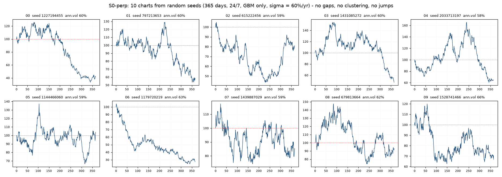

# perp フォーク (PerpDEX CLOB 24/7)

## perp フォーク (ブランチ `perp` — S0-perp: PerpDEX (CLOB・24/7) 骨格層)

同一リポジトリ・同一パッケージで `market_type` により分岐する (別リポジトリに
しない — 株式側の全ゲートとベースライン fixture が共有コアの回帰テストとして
機能し続けることがフォークの前提)。ブランチ運用: `master` = 株式 (S0〜S13)、
`perp` = このフォーク。分岐はレイヤー実装の差し替え (`build_calendar` が
`PerpCalendar` を選択) で行い、共通コア (rng / grid / L2 の確率過程 / 検証) は
分岐しない。

図の読み方 — S0-perp で株式版と違うのは時計とセッションの有無だけで、
価格モデルは同じ GBM である。

- (1) 時計の違い: equity は 1 日 = 6.5 時間 (23,400 秒) $\times$ 年 252 日で、
  セッションとセッションの間に窓が空く (S4 のオーバーナイト機構)。
  perp は 1 日 = 24 時間 (86,400 秒) $\times$ 年 365 日の連続市場で、窓は機構ごと
  存在しない — 実測でも日 d の始値と日 $d - 1$ の終値の差は厳密に 0 だった。
- (2) 同じ乱数・違う時計: 同一シード・同一 $\bar{\sigma}$ で時計だけを変えた対照。
  乱数の消費列は完全に同一 (`market_type` は RNG の鍵に入れていない) なので
  2 本の経路は形がそっくりのまま振幅だけが $\sqrt{252/365} = 0.831$ 倍になる。
  それぞれ自分の時計で年率化すれば両方とも $\bar{\sigma}$ に戻る (図では 0.569 / 0.569 —
  $\bar{\sigma} 0.60$ との差は 365 日標本のゆらぎ) が、時計を取り違えると 0.473 になり
  17% 静かにずれる (逆向き、株式のリターンを 365 日で年率化すると +20%)。
  これが時間軸の単一情報源 が防いでいる事故そのもので、実際に
  `scripts/generate_charts.py` にこの取り違えが埋まっていた (下記)。
- (3) S0-perp のチャート: それらしく見えないのが正解。 ローソクの大きさが
  一様で、ボラのクラスタリングも急落・急騰も無い。テールとクラスタリングは
  S1-perp 以降でボラ過程とジャンプから内生的に出すもので、ここで外生的に
  足すと時間集計で尖度が下がる性質 (集計正規性) が永久に再現できなくなる。
- (4) 日次リターンは正規: 10 本プール 3,650 点の QQ が直線、尖度 2.970
  (期待 3、SE 0.081)。下段の実現ボラも平坦で、散らばり sd(log RV) = 0.041 は
  推定ノイズだけの理論値 0.042 とほぼ一致 — ボラが本当に定数である直接証拠
  (S1-perp で確率ボラを入れると 0.5 級になる)。

再生成: `uv run python scripts/make_perp_fork_figure.py`

### S0-perp のチャート例 (ランダムなシード 10 本)

`uv run python scripts/make_perp_charts.py --n-charts 10` で生成
(`results/perp_S0/charts/` に日足 OHLC・個別ローソク足 10 枚・検証 JSON)。
メタシードから引いた乱数シードを index に記録してあるので、seed さえあれば
1 分刻みの全経路をビット単位で再生成できる。

出来高の欄は作っていない。 S0-perp に注文流は無い (L1 はスタブ・L3 板は無効)
ので、出来高を付ければそれは捏造になる。代わりに経路から実際に測れる量として
5 分足の日次実現ボラを出している。

検証で 1 点、精査が要った箇所がある: 10 本の日次 ACF のプール z が $- 3.20$ と
基準 |z| < 2 を超えた。独立な 40 シードで帰無分布を測ったところ、帰無平均は
既知バイアス $( - 1/365)$ に対し $z = - 0.33 =$ 系統バイアス無しで、今回の 10 本が
たまたま $- 2.45\sigma$ に偏った抽選と判明した。シードは引き直していない (結果を
見てから標本を選び直すのは生存バイアス)。この帰無対照は事後の付け足しに
しないよう、`make_perp_charts.py` に常時実行として組み込んで経緯ごと記録した。

### 最重要ゲート: 株式のビット単位不変

フォーク作業前の master (3439798) で S0/S3/S12/S13 の 4 構成 (RNG・L2 全成分・
板・結合・フィードバック・$\chi$・多資産の全経路) のダイジェストを
`tests/baselines_equity_fork.json` に固定し、`tests/test_perp_fork.py::
test_equity_baselines_unchanged_*` が毎回再実行して照合する — 時間軸
リファクタと全 perp 追加の後も 4 構成すべてビット単位一致 (全体 377 テスト
グリーン)。market_type は乱数の鍵に入れない (入れると株式の全経路が
変わる)。

### 設計要件既存不備 3 件の検証結果: 本リポジトリには存在しない (main への反映なし)

設計要件は別構造 (`market_sim/`・crc32 RNGBank・390 steps) を参照しており、
記述された不備を実コードで測定検証した:

| 指摘 | 実測 | 解決済み段階 |
|---|---|---|
| $\phi_\sigma$ が mean-1 正規化 (分散が Jensen で超過) | $\mathrm{mean}(\phi_\sigma^2) = 0.99999 / \mathrm{mean}(\phi_\lambda) = 0.99999$、`normalize_phi_sigma` / `normalize_phi_lambda` に分離済み | S4 |
| $\chi_2$ の特徴時間 1 日 (日周期と混同) | 設計 30.0 日・S12 本番実測 29.998 日・日周期帯パワー 8.8e-16。perp の週次帯 (5〜10 日) の外 | S5 |
| ON が日中の 2 倍で曖昧 | フィールドは `overnight_variance_share = 0.20` (cc 分散シェア)・実測比 1.036 | S4 |

3 件とも tests/test_perp_fork.py が恒久固定し、perp ゲート
(phi_sigma_normalization / phi_lambda_normalization / chaos_tau_band) が
毎実行で機構を検査する。

### 時間軸の単一情報源 (24/7 化の最大事故要因)

`simchart/grid.py` の `TimeGrid` + `config.ann_days` / `config.seconds_per_day`
が唯一の定義点。生成系の直接参照 (TRADING_DAYS_PER_YEAR / SESSION_SECONDS /
23400 リテラル) は掃引済みで、tokenize ベースのコード検査ゲート
(time_grid_single_source) が再発を監視する。検証系の 23 箇所も
`obs.session_seconds` / `cfg.seconds_per_day` 経由に統一 (equity は同一 float
なのでビット不変 — fixture が証明)。

consumer 側にも同じ罠が埋まっていた: `scripts/generate_charts.py` に
年率定数のハードコードが 11 箇所あり、perp 設定で走らせると全統計が
$\sqrt{365/252} = 1.20$ 倍ずれる状態だった。さらに出力先が `results_dir(stage)` =
`results/S0/charts` で、株式のベースラインチャートを上書きする。どちらも
上図パネル (2) の事故そのもので、config 経由の換算と `perp_S0` ラベルに修正した
(株式側の挙動は不変)。コード検査ゲートの対象は生成系だけなので、
scripts/ 配下に利用側コードを追加する際は、同じ規約を適用する必要がある。

| | equity | perp_clob |
|---|---|---|
| ann_days | 252 | 365 |
| seconds_per_day | 23,400 (6.5h) | 86,400 (24h) |
| steps_per_day (基準 config) | 23,400 (1 秒) | 1,440 (1 分) |
| sigma_bar | 0.2217 | 0.60 |
| セッション | continuous + ON ギャップ | 24h 連続・ギャップなし |

### S0-perp で宣言した perp フラグ (実装は担当段階で)

| フラグ / パラメータ | 担当 | 内容 |
|---|---|---|
| enable_weekly_seasonality, weekly_period_hours | S4-perp | 週次 168h の $\phi$ (UTC 日内 + 週次の 2 周期) |
| block_time_ms, sequencer_rule | S6-perp | ブロック時間の離散化・シーケンサ規則 |
| enable_funding, funding_interval_hours, funding_cap | S10-perp | TWAP 基差 から funding |
| enable_arbitrageur, arb_threshold_bps | S10-perp | 現物-perp 裁定 (基差の定常化) |
| enable_positions, enable_liquidation, position_repr, maintenance_margin, max_leverage, leverage_pareto_alpha, partial_liquidation_frac | S11-perp | L4 建玉・清算 (S10-perp で基差が定常になってから L3⇄L4 を閉じる) |
| enable_insurance_fund, enable_adl | S11-perp | 保険基金・ADL |
| enable_cross_margin | S13-perp | クロスマージン (多資産) |
| chaos_branching_target | S12-perp | $\chi_3$ の注入先切替 (n_t / leverage_appetite) |

RNG ストリーム追加: `l3.arbitrageur` / `l4.leverage_choice` /
`l4.position_assign` / `l4.liquidation_order` (既存名は不変更)。L4 は
`layers/l4_positions.py` のスタブ + `types_perp.py` (PositionBook / FundingState /
LiquidationEvent)。`validation/perp.py` は全 11 関数を宣言済み (S6/S10/S11-perp
分は not_applicable を返す — 形を先に固定する S0 の規約)。

### S0-perp 本番 (2,800 日 = 400 週 $\times 1,440$ 分足、GBM のみ)

27/27 ゲート全合格 (13.6 秒)。株式 S0 と同じく非現実的なのが正解:

| 量 | 実測 | ゲート |
|---|---|---|
| 尖度 (1 分、N=4.03M) | 3.0039 | [2.7, 3.3] 合格 (SE 0.0024) |
| ACF(1) の z | $- 0.22$ | \|z\| < 2 合格 (60 日スモークの +3.12 は seed42 の抽選 — 5 シードで $\pm 1.6$ を確認) |
| GPH d / VR 最大乖離 | 0.007 / 0.009 | 合格 |
| 時間スケール不変性 (1440 vs 288 steps) | 一致 | 合格 (24/7 化の最重要検査) |
| 週内プロファイル (7 ビン) | max/min = 1.0028 | < 1.05 合格 平坦 (週次季節性は S4-perp) |
| $\phi$ 正規化機構 | 誤差 4.5e-5 / 4.4e-5 | $\pm 0.001$ 合格 |
| 年率換算 | ann_days=365・86,400 s/日 | 合格 ($\sigma_{\mathrm{step}} = 0.60/ \sqrt{365 \cdot 1440}$ をテストが固定) |
| config 検証 / L4 スタブ発火 | 全発火 | 合格 |

実行: `uv run python -m simchart.cli run --config configs/s0_perp.yaml`
(結果は `results/perp_S0/` — 株式の `results/S0` ベースラインとは衝突しない)。

---
